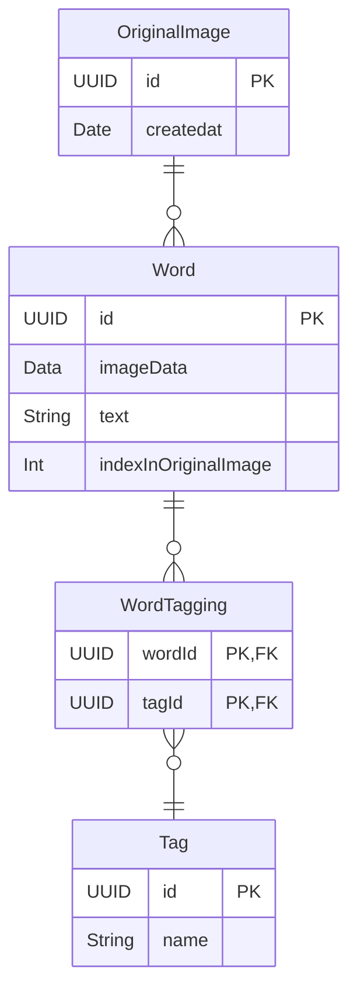

# mojisampler

## データベース設計

```mermaid
erDiagram
    OriginalImage ||--o{ Word : ""
    Word ||--o{ WordTagging : ""
    WordTagging }o--|| Tag : ""
    OriginalImage {
        UUID id PK
        Date createdat
    }
    Word {
        UUID id PK
        Data imageData
        String text
        Int indexInOriginalImage
    }
    WordTagging {
        UUID wordId PK,FK
        UUID tagId PK,FK
    }
    Tag {
        UUID id PK
        String name
    }
```
