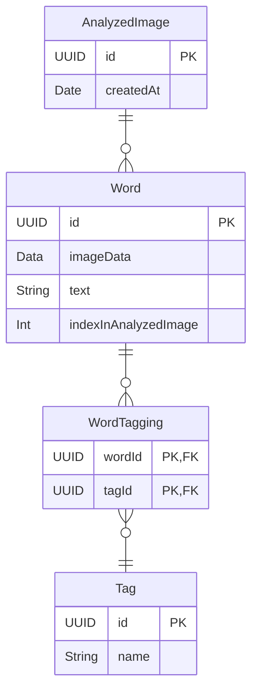

# mojisampler

## アーキテクチャ

MV Architecture

## データベース設計

```mermaid
erDiagram
    AnalyzedImage ||--o{ Word : ""
    Word ||--o{ WordTagging : ""
    WordTagging }o--|| Tag : ""
    AnalyzedImage {
        UUID id PK
        Date createdAt
    }
    Word {
        UUID id PK
        Data imageData
        String text
        Int indexInAnalyzedImage
    }
    WordTagging {
        UUID wordId PK,FK
        UUID tagId PK,FK
    }
    Tag {
        UUID id PK
        String name
    }
```
